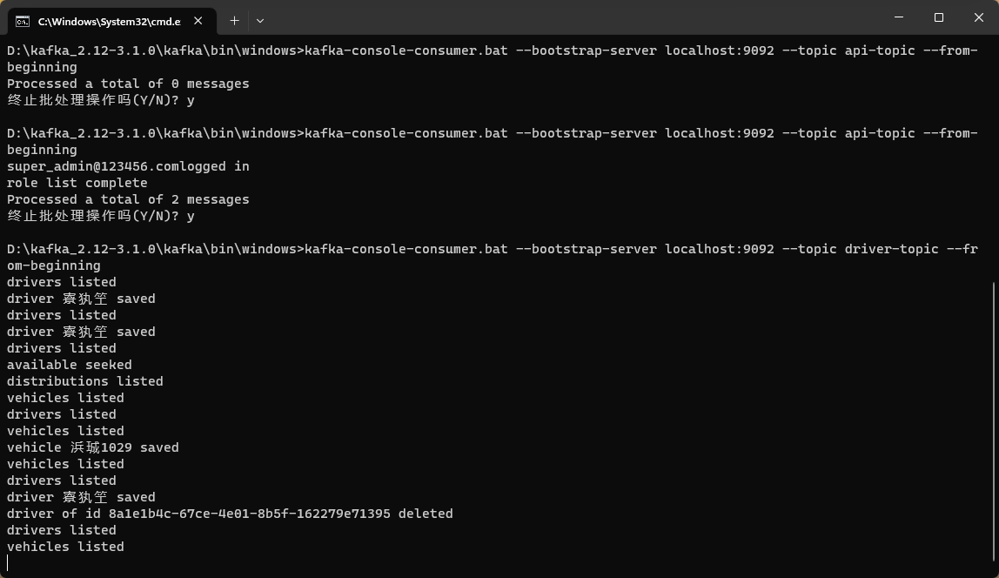

# 要求
Assignment 4, Event-notification for microservices
	In this assignment, you are asked to further improve your assignment 3 project by adding the following features:
_1, Integration of microservices with **event-driven brokers**._
_2, Distributed configuration with **spring cloud config server**.(optional)_
_3, Distributed log tracing with spring cloud sleuth or **Zipkin** (optional)_
1, You need to rebuild or develop microservices which are integrated with (**kafka**) **message-queue**, tVo form an event-driven architecture.
2, Optional, integrating **spring cloud config** server for centralized configuration.
3, Optional, integrating Sleuth for centralized log tracing.‘

# Event Driven Brokers
# Kafka
## 配置
Zookeeper，Kafka，

# 运行截图
完成所有方法配置后，前端在调用相应接口时即会向对应的Kafka话题中发送消息

