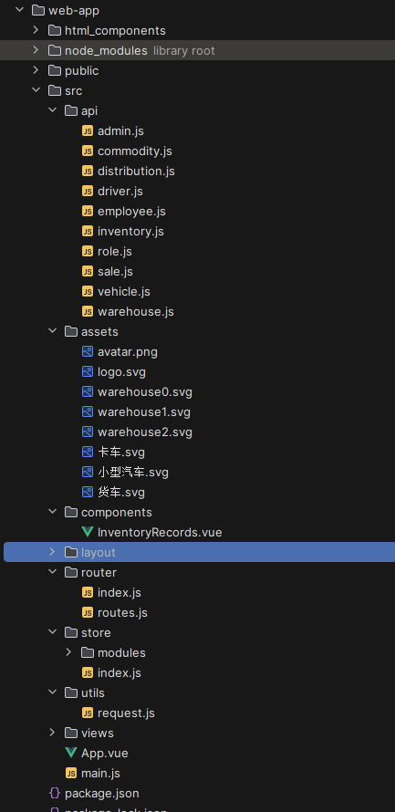

# 要求
Assignment 2, Re-design of assignment1 with REST API and More
	 In this assignment, you are asked to re-develop the shipping and transportation management web application using REST api and Ajax. 
**_Requirements:_**
1, Design and implement the shipping and transportation services with **Restful API**.
2, **API Authentication** and **authorization using spring security** and **JWT** is necessary.
3, Continuous Unit testing for new added functions and components are required.
4, You are encouraged to apply **openapi document**, rate limiting and etc to improve your rest api.
5, Web-End may need redesign with ajax and **vue.js** replacing thymeleaf.

# 系统设计
## 前端
（1） Vue2

（2） Ant Design & Ant Design Vue
（3） Axios

axios 是一个基于 Promise 的 HTTP 客户端，可以在浏览器和 Node.js 环境中使用，用于发送 HTTP 请求并处理响应。它具有以下特点：
支持浏览器和 Node.js 平台
支持 Promise API
支持拦截请求和响应
支持取消请求
支持自动转换 JSON 数据
支持客户端防御 XSRF（跨站请求伪造）
在 Vue.js 项目中，可以通过安装 axios 模块来发送 HTTP 请求，与 Vue.js 无缝集成。由于 axios 支持 Promise API，因此可以使用 async/await 等异步操作方式，更加方便地处理异步操作。同时，axios 还可以自定义拦截器，在请求和响应中添加特定的处理逻辑。

## 后端
（1） Spring Security
（2）JWT
